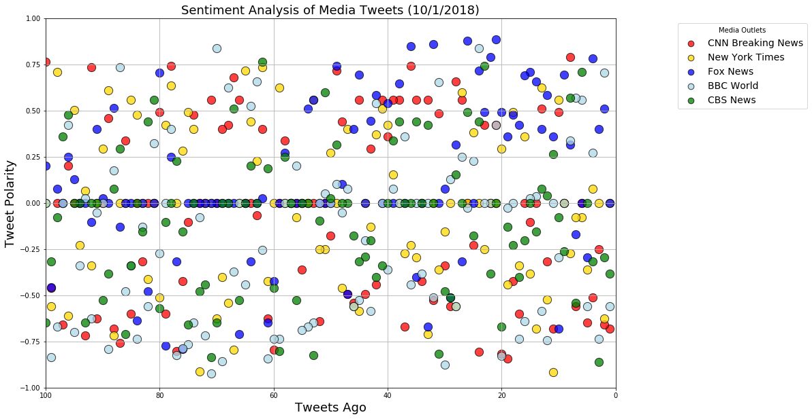
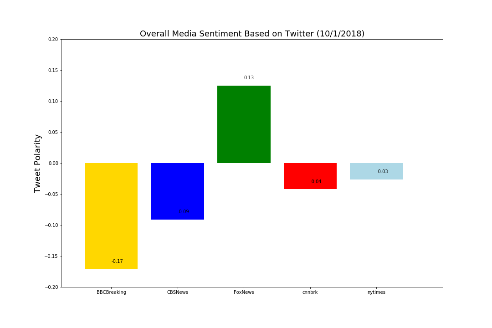

## News Tweet Sentiment Analysis Observations (100 most recent tweets as of 10/1/2018)

(Twitter handles used in analysis: @nytimes, @CNNbrk, @FoxNews, @BBCBreaking, @CBSNews)

Shown below are the results of the third time running the sentiment analysis within a 24-hour period. 

* After running the analysis three separate times within a 24-hour time period, the BBC consistently had the most negative score for sentiment analysis. This may be due to the specific handle selected for BBC (breaking news) and an interesting comparison would be BBCBreaking vs. other BBC news handles (BBCWorld).


* On the third and final analysis run, Fox News went from a negative score the prior two times to a positive score. The other news outlets didn't fluctuate as much; this might be due to a specific topic Fox News is positively tweeting  about at time of the analysis that other news outlets are not positively tweeting about. 


* These sentiment analysis results are likely to fluctuate greatly, depending on the news that happens within a particular day/week/month. An interesting analysis would be to compare news outlet sentiment analysis with top trending news during that time period to see if there is a consistent corrleation on how specific news topics are reported by a particluar news outlet, perhaps revealing bias. 


```python
# Dependencies
import tweepy
import numpy as np
import pandas as pd
import matplotlib.pyplot as plt

# Import and Initialize Sentiment Analyzer
from vaderSentiment.vaderSentiment import SentimentIntensityAnalyzer
analyzer = SentimentIntensityAnalyzer()

# Twitter API Keys
from config import (consumer_key, 
                    consumer_secret, 
                    access_token, 
                    access_token_secret)

# Setup Tweepy API Authentication
auth = tweepy.OAuthHandler(consumer_key, consumer_secret)
auth.set_access_token(access_token, access_token_secret)
api = tweepy.API(auth, parser=tweepy.parsers.JSONParser())
```


```python
# Target Search Term
target_terms = ("@nytimes", "@CNNbrk", "@FoxNews",
                "@BBCBreaking", "@CBSNews")
```


```python
# List to hold results
results_list = []

# Loop through all target users
for target in target_terms:

    counter = 1
    # Variable for holding the oldest tweet
    oldest_tweet = None
    
    # Loop through 1 times (total of 100 tweets each)
    for x in range(1):

        # Run search around each tweet
        public_tweets = api.user_timeline(
            target, count=100, result_type="recent", max_id=oldest_tweet)

        # Loop through all tweets
        for tweet in public_tweets:
            vs = analyzer.polarity_scores(tweet['text'])
            created_at = tweet['created_at']
            user = tweet['user']['screen_name']
            text = tweet['text']
            
            
            news_dict = {
                "Tweets Ago":counter,
                "User": user,
                "Date": created_at,
                "Text": text,
                "Compound": vs["compound"],
                "Positive": vs["pos"],
                "Negative": vs["neg"],
                "Neutral": vs["neu"]
            }
            
            # Set the new oldest_tweet value
            oldest_tweet = tweet["id"] - 1
            
            # Append list
            results_list.append(news_dict)
            
            # Update counter
            counter +=1
```


```python
# check tweet count
print(f"Tweet Count: {len(results_list)}")
```

    Tweet Count: 500


```python
# news_df = pd.DataFrame(results_list).set_index("User").round(3)
news_df = pd.DataFrame(results_list)

# re-order columns
reorder_news_df = news_df[["User","Tweets Ago","Date", "Text", "Compound", "Positive", "Negative", "Neutral"]]
reorder_news_df.head()
```


<div>
<style scoped>
    .dataframe tbody tr th:only-of-type {
        vertical-align: middle;
    }

    .dataframe tbody tr th {
        vertical-align: top;
    }

    .dataframe thead th {
        text-align: right;
    }
</style>
<table border="1" class="dataframe">
  <thead>
    <tr style="text-align: right;">
      <th></th>
      <th>User</th>
      <th>Tweets Ago</th>
      <th>Date</th>
      <th>Text</th>
      <th>Compound</th>
      <th>Positive</th>
      <th>Negative</th>
      <th>Neutral</th>
    </tr>
  </thead>
  <tbody>
    <tr>
      <th>0</th>
      <td>nytimes</td>
      <td>1</td>
      <td>Mon Oct 01 17:48:08 +0000 2018</td>
      <td>President Trump said he wanted a "comprehensiv...</td>
      <td>0.0000</td>
      <td>0.000</td>
      <td>0.000</td>
      <td>1.000</td>
    </tr>
    <tr>
      <th>1</th>
      <td>nytimes</td>
      <td>2</td>
      <td>Mon Oct 01 17:38:04 +0000 2018</td>
      <td>A year ago in Las Vegas, over 400 people were ...</td>
      <td>-0.6249</td>
      <td>0.000</td>
      <td>0.157</td>
      <td>0.843</td>
    </tr>
    <tr>
      <th>2</th>
      <td>nytimes</td>
      <td>3</td>
      <td>Mon Oct 01 17:28:02 +0000 2018</td>
      <td>For over 150 years, the identity of the nude s...</td>
      <td>0.0000</td>
      <td>0.000</td>
      <td>0.000</td>
      <td>1.000</td>
    </tr>
    <tr>
      <th>3</th>
      <td>nytimes</td>
      <td>4</td>
      <td>Mon Oct 01 17:18:03 +0000 2018</td>
      <td>For all the talk of leaning in, breaking glass...</td>
      <td>0.0772</td>
      <td>0.061</td>
      <td>0.000</td>
      <td>0.939</td>
    </tr>
    <tr>
      <th>4</th>
      <td>nytimes</td>
      <td>5</td>
      <td>Mon Oct 01 17:08:03 +0000 2018</td>
      <td>Venezuela's state oil company is deep in debt....</td>
      <td>-0.3612</td>
      <td>0.000</td>
      <td>0.116</td>
      <td>0.884</td>
    </tr>
  </tbody>
</table>
</div>


```python
# sort dataframe
news_sent_df = reorder_news_df.sort_values(["User","Tweets Ago"], ascending=[True, False])
news_sent_df.head()
```


<div>
<style scoped>
    .dataframe tbody tr th:only-of-type {
        vertical-align: middle;
    }

    .dataframe tbody tr th {
        vertical-align: top;
    }

    .dataframe thead th {
        text-align: right;
    }
</style>
<table border="1" class="dataframe">
  <thead>
    <tr style="text-align: right;">
      <th></th>
      <th>User</th>
      <th>Tweets Ago</th>
      <th>Date</th>
      <th>Text</th>
      <th>Compound</th>
      <th>Positive</th>
      <th>Negative</th>
      <th>Neutral</th>
    </tr>
  </thead>
  <tbody>
    <tr>
      <th>399</th>
      <td>BBCBreaking</td>
      <td>100</td>
      <td>Fri Aug 31 09:15:51 +0000 2018</td>
      <td>London’s new Crossrail underground line will n...</td>
      <td>0.0000</td>
      <td>0.000</td>
      <td>0.000</td>
      <td>1.000</td>
    </tr>
    <tr>
      <th>398</th>
      <td>BBCBreaking</td>
      <td>99</td>
      <td>Fri Aug 31 14:16:56 +0000 2018</td>
      <td>Naa'imur Zakariyah Rahman jailed for life with...</td>
      <td>-0.8360</td>
      <td>0.000</td>
      <td>0.283</td>
      <td>0.717</td>
    </tr>
    <tr>
      <th>397</th>
      <td>BBCBreaking</td>
      <td>98</td>
      <td>Fri Aug 31 15:53:33 +0000 2018</td>
      <td>Leader of pro-Russian self-declared Donetsk re...</td>
      <td>-0.6705</td>
      <td>0.000</td>
      <td>0.220</td>
      <td>0.780</td>
    </tr>
    <tr>
      <th>396</th>
      <td>BBCBreaking</td>
      <td>97</td>
      <td>Fri Aug 31 19:54:02 +0000 2018</td>
      <td>US-Canada trade talks break up without deal bu...</td>
      <td>0.0000</td>
      <td>0.000</td>
      <td>0.000</td>
      <td>1.000</td>
    </tr>
    <tr>
      <th>395</th>
      <td>BBCBreaking</td>
      <td>96</td>
      <td>Fri Aug 31 20:16:13 +0000 2018</td>
      <td>The United States is ending all funding for th...</td>
      <td>0.4215</td>
      <td>0.141</td>
      <td>0.000</td>
      <td>0.859</td>
    </tr>
  </tbody>
</table>
</div>


```python
# Save to CSV file
news_sent_df.to_csv("recentNewsTweets.csv", encoding="utf-8", index=False)
```


```python
nytimes_df = reorder_news_df.loc[(reorder_news_df["User"] == "nytimes")].set_index("User")
nytimes_df.head()
```


<div>
<style scoped>
    .dataframe tbody tr th:only-of-type {
        vertical-align: middle;
    }

    .dataframe tbody tr th {
        vertical-align: top;
    }

    .dataframe thead th {
        text-align: right;
    }
</style>
<table border="1" class="dataframe">
  <thead>
    <tr style="text-align: right;">
      <th></th>
      <th>Tweets Ago</th>
      <th>Date</th>
      <th>Text</th>
      <th>Compound</th>
      <th>Positive</th>
      <th>Negative</th>
      <th>Neutral</th>
    </tr>
    <tr>
      <th>User</th>
      <th></th>
      <th></th>
      <th></th>
      <th></th>
      <th></th>
      <th></th>
      <th></th>
    </tr>
  </thead>
  <tbody>
    <tr>
      <th>nytimes</th>
      <td>1</td>
      <td>Mon Oct 01 17:48:08 +0000 2018</td>
      <td>President Trump said he wanted a "comprehensiv...</td>
      <td>0.0000</td>
      <td>0.000</td>
      <td>0.000</td>
      <td>1.000</td>
    </tr>
    <tr>
      <th>nytimes</th>
      <td>2</td>
      <td>Mon Oct 01 17:38:04 +0000 2018</td>
      <td>A year ago in Las Vegas, over 400 people were ...</td>
      <td>-0.6249</td>
      <td>0.000</td>
      <td>0.157</td>
      <td>0.843</td>
    </tr>
    <tr>
      <th>nytimes</th>
      <td>3</td>
      <td>Mon Oct 01 17:28:02 +0000 2018</td>
      <td>For over 150 years, the identity of the nude s...</td>
      <td>0.0000</td>
      <td>0.000</td>
      <td>0.000</td>
      <td>1.000</td>
    </tr>
    <tr>
      <th>nytimes</th>
      <td>4</td>
      <td>Mon Oct 01 17:18:03 +0000 2018</td>
      <td>For all the talk of leaning in, breaking glass...</td>
      <td>0.0772</td>
      <td>0.061</td>
      <td>0.000</td>
      <td>0.939</td>
    </tr>
    <tr>
      <th>nytimes</th>
      <td>5</td>
      <td>Mon Oct 01 17:08:03 +0000 2018</td>
      <td>Venezuela's state oil company is deep in debt....</td>
      <td>-0.3612</td>
      <td>0.000</td>
      <td>0.116</td>
      <td>0.884</td>
    </tr>
  </tbody>
</table>
</div>


```python
cnnbrk_df = reorder_news_df.loc[(reorder_news_df["User"] == "cnnbrk")]
cnnbrk_df.head()
```


<div>
<style scoped>
    .dataframe tbody tr th:only-of-type {
        vertical-align: middle;
    }

    .dataframe tbody tr th {
        vertical-align: top;
    }

    .dataframe thead th {
        text-align: right;
    }
</style>
<table border="1" class="dataframe">
  <thead>
    <tr style="text-align: right;">
      <th></th>
      <th>User</th>
      <th>Tweets Ago</th>
      <th>Date</th>
      <th>Text</th>
      <th>Compound</th>
      <th>Positive</th>
      <th>Negative</th>
      <th>Neutral</th>
    </tr>
  </thead>
  <tbody>
    <tr>
      <th>100</th>
      <td>cnnbrk</td>
      <td>1</td>
      <td>Mon Oct 01 17:41:02 +0000 2018</td>
      <td>Musician Cardi B turns herself in to NYPD and ...</td>
      <td>-0.6808</td>
      <td>0.0</td>
      <td>0.228</td>
      <td>0.772</td>
    </tr>
    <tr>
      <th>101</th>
      <td>cnnbrk</td>
      <td>2</td>
      <td>Mon Oct 01 15:52:06 +0000 2018</td>
      <td>A Chinese destroyer came as close as 45 feet t...</td>
      <td>-0.6597</td>
      <td>0.0</td>
      <td>0.213</td>
      <td>0.787</td>
    </tr>
    <tr>
      <th>102</th>
      <td>cnnbrk</td>
      <td>3</td>
      <td>Mon Oct 01 15:14:51 +0000 2018</td>
      <td>Watch and follow live: President Trump talks a...</td>
      <td>-0.2500</td>
      <td>0.0</td>
      <td>0.091</td>
      <td>0.909</td>
    </tr>
    <tr>
      <th>103</th>
      <td>cnnbrk</td>
      <td>4</td>
      <td>Mon Oct 01 13:47:36 +0000 2018</td>
      <td>Officers fatally shot a patient at Orlando Reg...</td>
      <td>-0.5106</td>
      <td>0.0</td>
      <td>0.202</td>
      <td>0.798</td>
    </tr>
    <tr>
      <th>104</th>
      <td>cnnbrk</td>
      <td>5</td>
      <td>Mon Oct 01 13:46:47 +0000 2018</td>
      <td>Veteran French singer and songwriter Charles A...</td>
      <td>-0.6486</td>
      <td>0.0</td>
      <td>0.177</td>
      <td>0.823</td>
    </tr>
  </tbody>
</table>
</div>


```python
fox_df = reorder_news_df.loc[(reorder_news_df["User"] == "FoxNews")].set_index("User")
fox_df.head()
```


<div>
<style scoped>
    .dataframe tbody tr th:only-of-type {
        vertical-align: middle;
    }

    .dataframe tbody tr th {
        vertical-align: top;
    }

    .dataframe thead th {
        text-align: right;
    }
</style>
<table border="1" class="dataframe">
  <thead>
    <tr style="text-align: right;">
      <th></th>
      <th>Tweets Ago</th>
      <th>Date</th>
      <th>Text</th>
      <th>Compound</th>
      <th>Positive</th>
      <th>Negative</th>
      <th>Neutral</th>
    </tr>
    <tr>
      <th>User</th>
      <th></th>
      <th></th>
      <th></th>
      <th></th>
      <th></th>
      <th></th>
      <th></th>
    </tr>
  </thead>
  <tbody>
    <tr>
      <th>FoxNews</th>
      <td>1</td>
      <td>Mon Oct 01 17:44:14 +0000 2018</td>
      <td>.@jasoninthehouse: "The reason Donald Trump be...</td>
      <td>0.0000</td>
      <td>0.000</td>
      <td>0.000</td>
      <td>1.000</td>
    </tr>
    <tr>
      <th>FoxNews</th>
      <td>2</td>
      <td>Mon Oct 01 17:30:00 +0000 2018</td>
      <td>Hot air balloon hits German power line tower, ...</td>
      <td>0.5106</td>
      <td>0.216</td>
      <td>0.000</td>
      <td>0.784</td>
    </tr>
    <tr>
      <th>FoxNews</th>
      <td>3</td>
      <td>Mon Oct 01 17:15:00 +0000 2018</td>
      <td>First test tube lion cubs in the world are liv...</td>
      <td>0.4019</td>
      <td>0.153</td>
      <td>0.000</td>
      <td>0.847</td>
    </tr>
    <tr>
      <th>FoxNews</th>
      <td>4</td>
      <td>Mon Oct 01 16:57:10 +0000 2018</td>
      <td>Earlier, President @realDonaldTrump spoke abou...</td>
      <td>0.7845</td>
      <td>0.418</td>
      <td>0.000</td>
      <td>0.582</td>
    </tr>
    <tr>
      <th>FoxNews</th>
      <td>5</td>
      <td>Mon Oct 01 16:53:58 +0000 2018</td>
      <td>Dems accused of moving goalposts on Kavanaugh ...</td>
      <td>-0.2960</td>
      <td>0.000</td>
      <td>0.145</td>
      <td>0.855</td>
    </tr>
  </tbody>
</table>
</div>


```python
bbcbreaking_df = reorder_news_df.loc[(reorder_news_df["User"] == "BBCBreaking")].set_index("User")
bbcbreaking_df.head()
```


<div>
<style scoped>
    .dataframe tbody tr th:only-of-type {
        vertical-align: middle;
    }

    .dataframe tbody tr th {
        vertical-align: top;
    }

    .dataframe thead th {
        text-align: right;
    }
</style>
<table border="1" class="dataframe">
  <thead>
    <tr style="text-align: right;">
      <th></th>
      <th>Tweets Ago</th>
      <th>Date</th>
      <th>Text</th>
      <th>Compound</th>
      <th>Positive</th>
      <th>Negative</th>
      <th>Neutral</th>
    </tr>
    <tr>
      <th>User</th>
      <th></th>
      <th></th>
      <th></th>
      <th></th>
      <th></th>
      <th></th>
      <th></th>
    </tr>
  </thead>
  <tbody>
    <tr>
      <th>BBCBreaking</th>
      <td>1</td>
      <td>Mon Oct 01 12:16:14 +0000 2018</td>
      <td>French singer and songwriter Charles Aznavour ...</td>
      <td>-0.5574</td>
      <td>0.000</td>
      <td>0.167</td>
      <td>0.833</td>
    </tr>
    <tr>
      <th>BBCBreaking</th>
      <td>2</td>
      <td>Sun Sep 30 15:02:11 +0000 2018</td>
      <td>RT @5liveSport: That's it!\n\nMickelson hits t...</td>
      <td>0.7067</td>
      <td>0.204</td>
      <td>0.000</td>
      <td>0.796</td>
    </tr>
    <tr>
      <th>BBCBreaking</th>
      <td>3</td>
      <td>Sun Sep 30 06:52:14 +0000 2018</td>
      <td>At least 832 people now known to have died in ...</td>
      <td>-0.7351</td>
      <td>0.000</td>
      <td>0.292</td>
      <td>0.708</td>
    </tr>
    <tr>
      <th>BBCBreaking</th>
      <td>4</td>
      <td>Sat Sep 29 14:18:39 +0000 2018</td>
      <td>Senior Tory MPs have had their personal detail...</td>
      <td>0.2732</td>
      <td>0.122</td>
      <td>0.066</td>
      <td>0.812</td>
    </tr>
    <tr>
      <th>BBCBreaking</th>
      <td>5</td>
      <td>Sat Sep 29 07:33:05 +0000 2018</td>
      <td>At least 384 people now known to have died aft...</td>
      <td>-0.5574</td>
      <td>0.000</td>
      <td>0.167</td>
      <td>0.833</td>
    </tr>
  </tbody>
</table>
</div>


```python
cbsnews_df = reorder_news_df.loc[(reorder_news_df["User"] == "CBSNews")].set_index("User")
cbsnews_df.head()
```


<div>
<style scoped>
    .dataframe tbody tr th:only-of-type {
        vertical-align: middle;
    }

    .dataframe tbody tr th {
        vertical-align: top;
    }

    .dataframe thead th {
        text-align: right;
    }
</style>
<table border="1" class="dataframe">
  <thead>
    <tr style="text-align: right;">
      <th></th>
      <th>Tweets Ago</th>
      <th>Date</th>
      <th>Text</th>
      <th>Compound</th>
      <th>Positive</th>
      <th>Negative</th>
      <th>Neutral</th>
    </tr>
    <tr>
      <th>User</th>
      <th></th>
      <th></th>
      <th></th>
      <th></th>
      <th></th>
      <th></th>
      <th></th>
    </tr>
  </thead>
  <tbody>
    <tr>
      <th>CBSNews</th>
      <td>1</td>
      <td>Mon Oct 01 17:40:02 +0000 2018</td>
      <td>WATCH: Cardi B turned herself in to New York p...</td>
      <td>-0.3818</td>
      <td>0.0</td>
      <td>0.126</td>
      <td>0.874</td>
    </tr>
    <tr>
      <th>CBSNews</th>
      <td>2</td>
      <td>Mon Oct 01 17:14:58 +0000 2018</td>
      <td>Officials confirm body found in creek is missi...</td>
      <td>-0.2960</td>
      <td>0.0</td>
      <td>0.136</td>
      <td>0.864</td>
    </tr>
    <tr>
      <th>CBSNews</th>
      <td>3</td>
      <td>Mon Oct 01 16:39:49 +0000 2018</td>
      <td>"Mad Men" creator Matthew Weiner denies sexual...</td>
      <td>-0.8591</td>
      <td>0.0</td>
      <td>0.543</td>
      <td>0.457</td>
    </tr>
    <tr>
      <th>CBSNews</th>
      <td>4</td>
      <td>Mon Oct 01 16:39:07 +0000 2018</td>
      <td>.@POTUS on FBI investigation of Kavanaugh accu...</td>
      <td>-0.3182</td>
      <td>0.0</td>
      <td>0.113</td>
      <td>0.887</td>
    </tr>
    <tr>
      <th>CBSNews</th>
      <td>5</td>
      <td>Mon Oct 01 16:32:22 +0000 2018</td>
      <td>Reporter: You said some senators are not angel...</td>
      <td>0.0000</td>
      <td>0.0</td>
      <td>0.000</td>
      <td>1.000</td>
    </tr>
  </tbody>
</table>
</div>


```python
# figure size
plt.figure(figsize = (15,10))

cnn_scat = plt.scatter(cnnbrk_df["Tweets Ago"], cnnbrk_df["Compound"],color="red", s=150, edgecolors="black",alpha=0.75,label="CNN Breaking News")
nyt_scat = plt.scatter(nytimes_df["Tweets Ago"], nytimes_df["Compound"],color="gold", s=150, edgecolors="black",alpha=0.75,label="New York Times")
fox_scat = plt.scatter(fox_df["Tweets Ago"], fox_df["Compound"],color="blue", s=150, edgecolors="black",alpha=0.75,label="Fox News")
bbc_scat = plt.scatter(bbcbreaking_df["Tweets Ago"], bbcbreaking_df["Compound"], s=150, color="lightblue", edgecolors="black",alpha=0.75,label="BBC World")
cbs_scat = plt.scatter(cbsnews_df["Tweets Ago"], cbsnews_df["Compound"], s=150,color="green", edgecolors="black",alpha=0.75,label="CBS News")


# Set the x and y limits
plt.xlim(100, 0)
plt.ylim(-1, 1)


# Add labels to the x and y axes
plt.title(f"Sentiment Analysis of Media Tweets (10/1/2018)",fontdict = {'fontsize': 18})
plt.xlabel("Tweets Ago",fontdict = {'fontsize': 18})
plt.ylabel("Tweet Polarity",fontdict = {'fontsize': 18})


# Set a grid on plot and format legend
plt.grid()

# set up list for including plot legend when saving image/figure
legend_list = []

#plt.legend(bbox_to_anchor=(0, 1), loc='upper left', ncol=1)
lgnd = plt.legend(bbox_to_anchor=(1.1,1),loc="best", scatterpoints=1, fontsize=14, title="Media Outlets")
lgnd.legendHandles[0]._sizes = [75]
lgnd.legendHandles[1]._sizes = [75]
lgnd.legendHandles[2]._sizes = [75]
lgnd.legendHandles[3]._sizes = [75]
lgnd.legendHandles[4]._sizes = [75]

legend_list.append(lgnd)

# Save plot image (with legend) and show
plt.savefig("NewsScatterPlot.png", legend=legend_list, bbox_inches="tight")

plt.show()

```





```python
average_comp = news_sent_df.groupby("User")["Compound"].mean()
average_comp
```


    User
    BBCBreaking   -0.171083
    CBSNews       -0.091097
    FoxNews        0.125173
    cnnbrk        -0.042033
    nytimes       -0.026230
    Name: Compound, dtype: float64


```python
# figure size
plt.figure(figsize = (15,10))

x_axis = np.arange(len(average_comp))
xlabels = average_comp.index

# counter for bar labels loop
count = 0

# loop for bar labels
for comp in average_comp:
    plt.text(count, comp+.01, str(round(comp,2)))
    count = count + 1

# plot bar chart
plt.bar(x_axis, average_comp, tick_label = xlabels, color = ["gold","blue","green","red","lightblue"])

# Set the limits of the x axis
plt.xlim(-.75, len(x_axis))
# Set the limits of the y axis
plt.ylim(-.2, .2)


#Set title, x axis label, and y axis label.
plt.title(f"Overall Media Sentiment Based on Twitter (10/1/2018)",fontdict = {'fontsize': 18})
plt.ylabel("Tweet Polarity",fontdict = {'fontsize': 18})

# Save plot image and show
plt.savefig("NewsBarChart.png")
plt.show()
```




